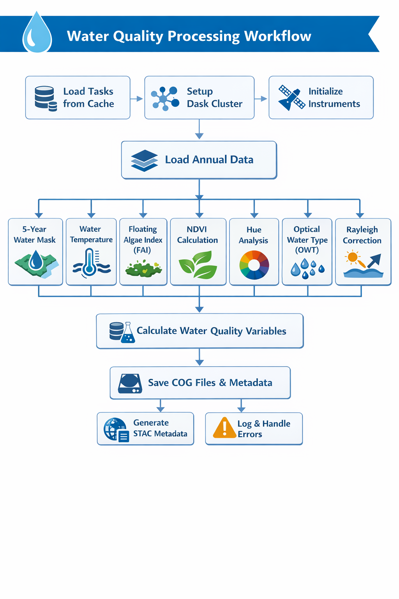

# DE Africa Water Quality Monitoring Service Pipeline

**Generate annual water quality variables from satellite imagery across Africa**

---

## Table of Contents

- [Overview](#overview)
- [Quick Start](#quick-start)
- [Getting Started](#getting-started)
- [Pipeline Commands](#pipeline-commands)
- [Configuration](#configuration)
- [Usage Examples](#usage-examples)
- [Output Products](#output-products)
- [Technical Details](#technical-details)
- [Troubleshooting](#troubleshooting)
- [Reference](#reference)

---

## Overview

The DE Africa Water Quality Pipeline processes multi-sensor satellite imagery to generate annual water quality metrics across African water bodies. The pipeline produces spatially-explicit measurements including:

- **Water Frequency Statistics** – Temporal water presence patterns
- **Optical Water Types** – Water classification based on optical properties
- **Chlorophyll-a Concentration** – Primary productivity indicator
- **Total Suspended Matter (TSM)** – Water clarity metrics
- **Trophic State Index (TSI)** – Productivity classification
- **Surface Temperature** – Thermal characteristics
- **Floating Algal Index (FAI)** – Algal bloom detection

### Key Features

✓ Multi-sensor data fusion (Landsat 5/8/9, Sentinel-2)  
✓ Annual geomedian composites for cloud-free analysis  
✓ Scalable parallel processing architecture  
✓ Cloud Optimized GeoTIFF (COG) outputs  
✓ STAC-compliant metadata

---

## Quick Start

```bash
# 1. Install the package
git clone <repository-url>
cd deafrica_water_quality
pip install -e .

# 2. Generate processing tasks for 2020
wq-generate-tasks 2020--P1Y annual tasks_2020.txt

# 3. Run the pipeline
wq-process-annual-wq-variables \
  --tasks-file tasks_2020.txt \
  --analysis-config cfg.yaml \
  /output/wq_products/ \
  1 \
  0
```

---

## Getting Started

### Prerequisites

**Environment Requirements:**
- Access to DE Africa Sandbox datacube environment
- Python environment with pipeline dependencies
- YAML configuration file for analysis parameters
- Appropriate filesystem access (local or cloud storage)

**Installation:**

```bash
# Clone the repository
git clone <repository-url>

# Install in editable mode
cd deafrica_water_quality
pip install -e .

# Restart kernel if working on DE Africa Sandbox
```

### Understanding Key Concepts

**Tile**: A single cell from the regular spatial grid defined in [`water_quality.grid`](https://github.com/vikineema/deafrica_water_quality/blob/main/src/water_quality/grid.py) module. Africa is divided into tiles for efficient parallel processing.

**Temporal Range**: Time period specified in ISO 8601 format (e.g., `2020--P1Y` for year 2020, `2020-05--P1M` for May 2020).

**Frequency**: Temporal binning interval for analysis:
- `annual` – Yearly composites
- `semiannual` – Half-yearly
- `monthly` – Monthly
- `fortnightly` – Bi-weekly
- `weekly` – Weekly

---

## Pipeline Commands

The pipeline operates in two stages:

### Stage 1: Generate Tasks

**Command:** `wq-generate-tasks`

Generates a list of processing tasks based on temporal range, frequency, and spatial tiles.

```bash
wq-generate-tasks [OPTIONS] TEMPORAL_RANGE FREQUENCY OUTPUT_FILE
```

**Arguments:**

| Argument | Description | Example |
|----------|-------------|---------|
| `TEMPORAL_RANGE` | Time period (ISO 8601 format) | `2020--P1Y`, `2020-05--P1M` |
| `FREQUENCY` | Temporal binning interval | `annual`, `monthly`, `weekly` |
| `OUTPUT_FILE` | Path to output task list | `tasks_2020.txt` |

**Options:**

| Option | Description | Example |
|--------|-------------|---------|
| `--tile-ids` | Comma-separated tile IDs | `x188/y109,x178/y095` |
| `--tile-ids-file` | Path to file with tile IDs | `tiles.txt` |
| `--place-name` | Predefined test area name | `SA_smalldam1` |

> **Note:** Specify exactly one of `--tile-ids`, `--tile-ids-file`, or `--place-name`. If none specified, generates tasks for all African tiles.

**Temporal Range Behavior:**

If your temporal range doesn't align with frequency boundaries, the pipeline loads complete temporal bins:

- `2025-08-13--P3D` with `weekly` → loads full week `2025-08-13--P1W`
- `2025-08-13--P1M` with `monthly` → loads both `2025-08--P1M` and `2025-09--P1M`

**Output Format:**

Text file with one task per line: `{temporal_id}/x{xx}/y{yy}`

Example:
```
2015--P1Y/x200/y034
2015--P1Y/x200/y035
2015--P1Y/x201/y034
```

---

### Stage 2: Process Water Quality Variables

**Command:** `wq-process-annual-wq-variables`

Processes tasks to generate annual water quality variables as Cloud Optimized GeoTIFFs.

```bash
wq-process-annual-wq-variables [OPTIONS] OUTPUT_DIRECTORY MAX_PARALLEL_STEPS WORKER_IDX
```

**Arguments:**

| Argument | Description | Example |
|----------|-------------|---------|
| `OUTPUT_DIRECTORY` | Directory for outputs (COGs, CSVs, STAC metadata) | `/output/wq_products/` |
| `MAX_PARALLEL_STEPS` | Total number of parallel workers/pods | `10` |
| `WORKER_IDX` | Zero-indexed worker ID (which subset to process) | `0` |

**Options:**

| Option | Description |
|--------|-------------|
| `--tasks` | Comma-separated task IDs |
| `--tasks-file` | Path to task file from Stage 1 (recommended) |
| `--analysis-config` | **Required** - YAML configuration file path |
| `--overwrite` / `--no-overwrite` | Reprocess existing outputs (default: False) |

> **Note:** Must specify either `--tasks` or `--tasks-file`, but not both.

**Parallel Processing:**

For Jupyter Notebook or serial processing:
- Set `MAX_PARALLEL_STEPS` = `1`
- Set `WORKER_IDX` = `0`

For parallel processing (e.g., Argo Workflows):
- Set `MAX_PARALLEL_STEPS` to number of workers
- Each worker gets a unique `WORKER_IDX` (0, 1, 2, ...)

---

## Configuration

### Configuration File Structure

Create a YAML file (e.g., `cfg.yaml`) to control pipeline behavior:

```yaml
# Spatial resolution in meters (for EPSG:6933 projection)
resolution: 30

# Satellite instruments to use
instruments_to_use:
  oli_agm:      # Landsat 8/9 OLI annual Geomedians
    use: true
  oli:          # Landsat 8/9 OLI surface reflectance collection
    use: false
  msi_agm:      # Sentinel-2 MSI annual Geomedians
    use: true
  msi:          # Sentinel-2 MSI surface reflectance collection
    use: false
  tm_agm:       # Landsat 5 TM annual Geomedians
    use: true
  tm:           # Landsat 5 TM surface reflectance collection
    use: false
  tirs:         # Landsat 5/8/9 Thermal infrared bands
    use: true
  wofs_ann:     # Annual Water Observations from Space
    use: true

# Water detection thresholds
water_frequency_threshold_high: 0.5   # High confidence water (>50% frequency)
water_frequency_threshold_low: 0.1    # Low confidence water (>10% frequency)
permanent_water_threshold: 0.0875     # Permanent water classification
sigma_coefficient: 1.2                # Statistical confidence parameter

# Product metadata
product:
  name: "wq_<frequency>"           # ODC product name prefix (e.g., wq_annual)
  version: "1.0.0"      # Product version
```

### Configuration Parameters

| Parameter | Description | Typical Values | Impact |
|-----------|-------------|----------------|--------|
| `resolution` | Output spatial resolution (meters) | 10, 30, 60 | Processing time, file size |
| `water_frequency_threshold_high` | Minimum frequency for high-confidence water | 0.4 - 0.6 | Water mask strictness |
| `water_frequency_threshold_low` | Minimum frequency for low-confidence water | 0.1 - 0.3 | Algorithm application scope |
| `permanent_water_threshold` | Permanent water classification threshold | 0.05 - 0.15 | Permanent vs. seasonal water |
| `sigma_coefficient` | Standard deviation multiplier for confidence | 0.5 - 2.0 | Confidence interval width |

### Instrument Selection Guide

**Geomedian (AGM) Products** – Recommended for annual analysis:
- Cloud-free annual composites
- Reduced noise and outliers
- Better for long-term trends

**Surface Reflectance Collections** – For high temporal resolution:
- All available observations
- Useful for seasonal analysis
- Requires more processing time

---

## Usage Examples

### Example 1: Continental Processing

Process all of Africa for a single year:

```bash
# Generate tasks for all African tiles
wq-generate-tasks 2020--P1Y annual /output/tasks_2020.txt

# Process with 10 parallel workers (worker 0)
wq-process-annual-wq-variables \
  --tasks-file /output/tasks_2020.txt \
  --analysis-config cfg.yaml \
  /output/wq_products/ \
  10 \
  0
```

### Example 2: Test Area Processing

Process a specific test area with overwrite enabled:

```bash
# View available test areas
wq-list-test-areas

# Generate tasks for test area
wq-generate-tasks \
  --place-name "SA_smalldam1" \
  2019--P1Y annual \
  /output/SA_smalldam1_tasks.txt

# Process with single worker and overwrite
wq-process-annual-wq-variables \
  --tasks-file /output/SA_smalldam1_tasks.txt \
  --analysis-config cfg.yaml \
  --overwrite \
  /output/wq_products/ \
  1 \
  0
```

### Example 3: Specific Tiles

Process custom tile selection:

```bash
# Generate tasks for specific tiles
wq-generate-tasks \
  --tile-ids "x188/y109,x178/y095" \
  2021--P1Y annual \
  /output/custom_tasks.txt

# Process with 4 parallel workers (worker 2)
wq-process-annual-wq-variables \
  --tasks-file /output/custom_tasks.txt \
  --analysis-config cfg.yaml \
  /output/wq_products/ \
  4 \
  2
```

### Example 4: Retry Failed Tasks

If some tasks fail, retry only those tasks:

```bash
# Failed tasks are logged to /tmp/failed_tasks
# Extract and reprocess them
wq-process-annual-wq-variables \
  --tasks "2020--P1Y/x188/y109,2020--P1Y/x178/y095" \
  --analysis-config cfg.yaml \
  --overwrite \
  /output/wq_products/ \
  1 \
  0
```

---

## Output Products

### File Structure

```
{output_dir}/
└── {product_name}/
    └── {product_version}/
        └── {temporal_id}/
            └── {tile_id}/
                ├── {band_name}.tif           # COG for each variable
                ├── wq_parameters.csv         # Water quality summary
                └── metadata.stac.json        # STAC metadata
```

**Example:**
```
/output/wq_products/
└── wq_annual/
    └── 1.0.0/
        └── 2020--P1Y/
            └── x188/
                └── y109/
                    ├── chla.tif
                    ├── tsm.tif
                    ├── tsi.tif
                    ├── owt_msi.tif
                    ├── wofs_ann_freq.tif
                    ├── wq_parameters.csv
                    └── metadata.stac.json
```

### Generated Variables

#### Water Frequency & Classification

| Variable | Description | Instrument | Units | Range |
|----------|-------------|-------|-------|
| `watermask` | 5 year average Binary water mask | WOFS_ann |Boolean | 0/1 |
| `clear_water` |Clear water Binary water mask | Geomedian FAI and watermask| Boolean | 0/1 |

#### Water Quality Variables

| Variable | Description | Algorithm | Instrument | Units |
|----------|-------------|-----------|------------|-------|
| `chla` | Chlorophyll-a concentration (stacked) | Multiple | Multi-sensor | μg/L |
| `tsm` | Total Suspended Matter (stacked) | Multiple | Multi-sensor | g/m³ |
| `tsi` | Trophic State Index | Carlson (1977) | Derived from ChlA | 0-100 |
| `agm_fai`,`msi_agm_fai`,`oli_agm_fai`,`tm_agm_fai` | Floating Algal Index | FAI algorithm | Multi-sensor| Index |
| `agm_hue`,`msi_agm_hue`,`oli_agm_hue`,`tm_agm_hue`| Water color hue | Hue calculation | Multi-sensor | Degrees |
| `agm_ndvi`,`msi_agm_ndvi`,`oli_agm_ndvi`,`tm_agm_ndvi` | Normalized Difference Vegetation Index | NDVI | Multi-sensor| -1 to 1 |

#### Optical Water Types

| Variable | Description | Instrument | Classes |
|----------|-------------|------------|---------|
| `agm_owt` | Optical Water Type classification |Combined | 1-13 |
| `msi_agm_owt` | Optical Water Type classification | Sentinel-2 MSI | 1-13 |
| `oli_agm_owt` | Optical Water Type classification | Landsat OLI | 1-13 |
| `tm_agm_owt` | Optical Water Type classification | Landsat tm | 1-13 |
**OWT Classifications** (Spyrakos et al., 2018):

| OWT | Dominant Characteristics |
|-----|--------------------------|
| OWT1 | Hypereutrophic waters with cyanobacterial scum, vegetation-like Rrs |
| OWT2 | Common case waters, diverse reflectance, marginal dominance of pigments/CDOM over inorganic particles |
| OWT3 | Clear waters |
| OWT4 | Turbid waters with high organic content |
| OWT5 | Sediment-laden waters |
| OWT6 | Balanced optically active constituents at shorter wavelengths |
| OWT7 | Highly productive waters with high cyanobacteria, elevated red/NIR reflectance |
| OWT8 | Productive waters with cyanobacteria, Rrs peak near 700 nm |
| OWT9 | Similar to OWT2 but higher Rrs at shorter wavelengths |
| OWT10 | CDOM-rich waters |
| OWT11 | CDOM-rich with cyanobacteria presence, high NAP absorption efficiency |
| OWT12 | Turbid, moderately productive waters with cyanobacteria |
| OWT13 | Very clear blue waters |

#### Surface Temperature

| Variable | Description | Instrument | Units |
|----------|-------------|------------|-------|
| `tirs_st_ann_max` | Maximum annual water temperature | Landsat TIRS | °C or K |
| `tirs_st_ann_min` | Minimum annual water temperature | Landsat TIRS | °C or K |
| `tirs_st_ann_med` | Median annual water temperature | Landsat TIRS | °C or K |

### Output File Formats

**Cloud Optimized GeoTIFF (COG):**
- Data type: float32/64
- NoData value: NaN (for non-WQ variables)
- Compression: Optimized for web access
- Internal tiling for efficient partial reads

**CSV (wq_parameters.csv):**
- Summary table of all computed water quality variables
- Includes algorithm metadata and processing parameters

**STAC Metadata (metadata.stac.json):**
- Source dataset UUIDs
- Spatial/temporal extent
- Band information and descriptions
- Processing lineage

---

## Technical Details

### Processing Workflow

```
1. Task Distribution
   ↓
2. Data Loading
   ↓
3. Water Detection & Classification
   ↓
4. Dark Pixel Correction
   ↓
5. Optical Property Calculation: Rayleigh correction
   ├── Hue 
   ├── OWT Classification
   ├── NDVI
   └── Surface Temperature
   ↓
6. Water Quality Variable Calculation
   ├── Chlorophyll-a (multiple algorithms)
   ├── Total Suspended Matter
   ├── Trophic State Index
   └── Floating Algal Index
   ↓
7. Data Cleanup
   ↓
8. Output Generation
   ├── COG Files (per band)
   ├── CSV Summary
   └── STAC Metadata
```
**Detailed Diagram:**

*Figure 1: Detailed water quality processing workflow*


### Processing Modules

The pipeline's water quality calculations are organized into specialized modules:

#### Core Processing Modules

| Module | Purpose | Key Functions |
|--------|---------|---------------|
| [`load_data.py`](https://github.com/vikineema/deafrica_water_quality/blob/main/src/water_quality/mapping/load_data.py) | Data loading and validation | Task validation, datacube queries, multi-sensor dataset construction |
| [`water_detection.py`](https://github.com/vikineema/deafrica_water_quality/blob/main/src/water_quality/mapping/water_detection.py) | Water mask generation | WOFS-based water classification, confidence interval calculation |
| [`pixel_correction.py`](https://github.com/vikineema/deafrica_water_quality/blob/main/src/water_quality/mapping/pixel_correction.py) | Atmospheric correction | Rayleigh_correction for reflectance data |

#### Optical Property Modules

| Module | Output Variables | Description |
|--------|------------------|-------------|
| [`hue.py`](https://github.com/vikineema/deafrica_water_quality/blob/main/src/water_quality/mapping/hue.py) | `{instrument}_agm_hue`, `agm_hue` | Water color hue calculation across geomedian instruments and mean weighted hue |
| [`optical_water_type.py`](https://github.com/vikineema/deafrica_water_quality/blob/main/src/water_quality/mapping/optical_water_type.py) | `{instrument}_agm_owt`, `agm_owt` | OWT classification (13 classes) for MSI and OLI sensors and the combined optical water types |
| [`ndvi.py`](https://github.com/vikineema/deafrica_water_quality/blob/main/src/water_quality/mapping/ndvi.py) | `{instrument}_ndvi`, `agm_ndvi` | Normalized Difference Vegetation Index for water pixels and the mean weighted ndvi|
| [`temperature.py`](https://github.com/vikineema/deafrica_water_quality/blob/main/src/water_quality/mapping/temperature.py) | `tirs_st_ann_max`, `tirs_st_ann_min`, `tirs_st_ann_med`| Annual composite of surface temperature from TIRS |

#### Water Quality Algorithm Modules

| Module | Output Variables | Description |
|--------|------------------|-------------|
| [`fai.py`](https://github.com/vikineema/deafrica_water_quality/blob/main/src/water_quality/mapping/fai.py) | `{instrument}_fai`, `agm_fai` | Floating Algal Index for algal bloom detection |
| [`algorithms.py`](https://github.com/vikineema/deafrica_water_quality/blob/main/src/water_quality/mapping/algorithms.py) | `chla`, `tsm`, `tsi` | Main WQ variables: Chlorophyll-a, Total Suspended Matter, Trophic State Index |

<!-- ### Key Processing Steps

<details>
<summary><b>1. Task Distribution</b></summary>

Tasks are split equally across workers using `numpy.array_split()`. Each worker processes its assigned subset based on `WORKER_IDX`. Workers beyond available task chunks automatically skip processing.

**Example Distribution:**
```
Total tasks: 100, Max parallel steps: 4

Worker 0: tasks 0-24   (25 tasks)
Worker 1: tasks 25-49  (25 tasks)
Worker 2: tasks 50-74  (25 tasks)
Worker 3: tasks 75-99  (25 tasks)
```
</details>

<details>
<summary><b>2. Data Loading</b></summary>

**Module:** [`load_data.py`](https://github.com/vikineema/deafrica_water_quality/blob/main/src/water_quality/mapping/load_data.py)

- Validates task frequency (annual only)
- Checks for existing outputs (skips unless `--overwrite`)
- Determines tile bounding box from grid specification
- Filters instruments based on data availability
- Builds datacube queries for multi-sensor data
- Creates Dask cluster if running on Sandbox
- Constructs multi-sensor/multi-temporal dataset
</details>

<details>
<summary><b>3. Water Detection & Classification</b></summary>

**Module:** [`water_detection.py`](https://github.com/vikineema/deafrica_water_quality/blob/main/src/water_quality/mapping/water_detection.py)

**Process:**
- Analyzes 5 years of WOFS annual data
- Classifies pixels: sometimes water, usually water, permanent water
- Calculates confidence intervals using sigma coefficient

**Classification thresholds:**
- High confidence water: `wofs_freq > water_frequency_threshold_high`
- Low confidence water: `wofs_freq > water_frequency_threshold_low`
- Permanent water: `wofs_freq > permanent_water_threshold`
</details>

<details>
<summary><b>4. Dark Pixel Correction</b></summary>

**Module:** [`pixel_correction.py`](https://github.com/vikineema/deafrica_water_quality/blob/main/src/water_quality/mapping/pixel_correction.py)

Applies R_correction to reflectance data to account for atmospheric scattering, path radiance, and adjacency effects. Corrected reflectance is used for all water quality algorithms.
</details>

<details>
<summary><b>5. Optical Property Calculation</b></summary>

**Modules:**
- **Hue:** [`hue.py`](https://github.com/vikineema/deafrica_water_quality/blob/main/src/water_quality/mapping/hue.py) - Calculates water color hue across MSI geomedian instruments, produces weighted mean
- **OWT:** [`optical_water_type.py`](https://github.com/vikineema/deafrica_water_quality/blob/main/src/water_quality/mapping/optical_water_type.py) - Classifies water into 13 optical types for MSI and OLI, uses 3x resampling
- **NDVI:** [`ndvi.py`](https://github.com/vikineema/deafrica_water_quality/blob/main/src/water_quality/mapping/ndvi.py) - Calculates vegetation index across instruments, produces weighted mean
- **Temperature:** [`temperature.py`](https://github.com/vikineema/deafrica_water_quality/blob/main/src/water_quality/mapping/temperature.py) - Processes TIRS data for annual max/min surface temperature
</details>

<details>
<summary><b>6. Water Quality Variable Calculation</b></summary>

**Modules:**
- **FAI:** [`fai.py`](https://github.com/vikineema/deafrica_water_quality/blob/main/src/water_quality/mapping/fai.py) - Floating Algal Index for bloom detection
- **Main WQ Variables:** [`algorithms.py`](https://github.com/vikineema/deafrica_water_quality/blob/main/src/water_quality/mapping/algorithms.py) - Computes chlorophyll-a (multiple algorithms), total suspended matter, and trophic state index

**Trophic State Index:**
- Based on Carlson (1977) classification
- Derived from chlorophyll-a concentration
- Scale: 0-100 (oligotrophic to hypereutrophic)

**Variable Stacking:**
- Individual algorithm outputs normalized and combined
- Creates unified `chla` and `tsm` variables
- Maintains provenance in `wq_parameters.csv`
</details>

<details>
<summary><b>7. Data Cleanup</b></summary>

- Retains water quality outputs and essential variables
- Drops intermediate reflectance bands
- Standardizes all bands to float32
- Sets appropriate NoData values
- Adds metadata attributes
</details>

<details>
<summary><b>8. Error Handling</b></summary>

- Continues processing on individual task failures
- Logs failed tasks to `/tmp/failed_tasks` (JSON format)
- Exit code: 1 if any failures, 0 if all succeed
- Detailed error messages for debugging
</details> -->

### Parallel Processing Strategy

**Worker Distribution:** Tasks split using `numpy.array_split()` for equal distribution

**Optimization Tips:**
- Set `MAX_PARALLEL_STEPS` based on compute resources
- Monitor memory with high-resolution processing
- Use cloud storage for distributed workflows
- Enable Dask for memory-intensive tasks

**Resource Scaling:**
```
Resolution | Typical Memory | Recommended Workers
-----------|----------------|--------------------
60m        | 4-8 GB        | 10-20
30m        | 8-16 GB       | 5-10
10m        | 16-32 GB      | 2-5
```

---

## Troubleshooting

### Common Issues

<details>
<summary><b>Task frequency mismatch</b></summary>

**Error:** `Expecting tasks with an annual frequency '1Y' not {freq}`

**Solution:** Ensure tasks were generated with `annual` frequency. `wq-process-annual-wq-variables` only processes annual tasks.
</details>

<details>
<summary><b>Missing output files</b></summary>

**Check:**
- Filesystem permissions: `ls -ld /output/wq_products/`
- Disk space: `df -h /output/`
- Worker logs for errors
- Tile contains water pixels

**Review logs:**
```bash
cat /tmp/wq_worker_0.log
```
</details>

<details>
<summary><b>Instrument data unavailable</b></summary>

**Behavior:** Pipeline filters out instruments without data for date range

**Note:** Processing fails if no instruments have data for temporal range

**Check:** Ensure at least one enabled instrument has data for your dates (e.g., Landsat 5 TM ended in 2012)
</details>

<details>
<summary><b>Worker skipped</b></summary>

**Message:** `Worker {idx} Skipped!`

**Cause:** Worker index exceeds number of task chunks (normal when `MAX_PARALLEL_STEPS` > tasks)

**Action:** None required, or reduce `MAX_PARALLEL_STEPS`
</details>

<details>
<summary><b>Failed tasks</b></summary>

**Location:** `/tmp/failed_tasks` (JSON array)

**Retry workflow:**
```bash
# Review failures
cat /tmp/failed_tasks

# Extract task IDs
jq -r '.[]' /tmp/failed_tasks > failed_tasks.txt

# Reprocess
wq-process-annual-wq-variables \
  --tasks-file failed_tasks.txt \
  --analysis-config cfg.yaml \
  --overwrite \
  /output/wq_products/ \
  1 \
  0
```
</details>

<details>
<summary><b>Memory errors</b></summary>

**Causes:**
- High resolution (10m)
- Large tiles
- Too many instruments
- Insufficient resources

**Solutions:**
1. Reduce resolution in config
2. Process fewer tiles per worker
3. Disable unused instruments
4. Increase worker memory
5. Enable Dask distributed processing
</details>

### Performance Considerations

| Factor | Impact | Recommendation |
|--------|--------|----------------|
| Resolution | Higher = more memory/time | Use 30m for most applications |
| Instruments | More = more memory/time | Enable only necessary instruments |
| Dask | Auto-enabled on Sandbox | Provides distributed computation |
| COG Writing | In-memory creation | Reduces I/O overhead |
| Skip Logic | Avoids reprocessing | Use `--no-overwrite` for production |
| Parallel Workers | Scales processing | Match to available resources |

---

## Reference

### Supporting Data

**Tile and Waterbody Mapping**

**File:** `data/wq_tile_ids_and_waterbodies_uids.parquet`

- Maps waterbody UIDs (DE Africa Historical Extent) to tile IDs
- Shows tile-waterbody intersections
- **Must be updated** with each Historical Extent release

**Update Script:** `data/tiles_and_waterbody_uids.py`

### Related Commands

| Command | Description |
|---------|-------------|
| `wq-list-test-areas` | View available predefined test areas |
| `wq-generate-tiles` | Generate tile IDs for custom AOIs |

### Version Compatibility

| Component | Notes |
|-----------|-------|
| Pipeline code | Check git tags/releases |
| Configuration product version | Specified in `cfg.yaml` |
| Output product version | Must match config version |
| DE Africa Historical Extent | Update waterbody mapping file with new releases |

### Grid System

Fixed grid defined in [`water_quality.grid`](https://github.com/vikineema/deafrica_water_quality/blob/main/src/water_quality/grid.py):

- **CRS:** EPSG:6933 (Africa Albers Equal Area Conic)
- **Tile Size:** Typically 100km × 100km
- **Naming:** `x{xxx}/y{yyy}` format
- **Coverage:** All of Africa

### Glossary

| Term | Definition |
|------|------------|
| **AGM** | Annual Geomedian - cloud-free composite image |
| **COG** | Cloud Optimized GeoTIFF - web-optimized raster format |
| **ChlA** | Chlorophyll-a concentration (μg/L) |
| **CDOM** | Colored Dissolved Organic Matter |
| **FAI** | Floating Algal Index |
| **MSI** | MultiSpectral Instrument (Sentinel-2) |
| **NDCI** | Normalized Difference Chlorophyll Index |
| **NDVI** | Normalized Difference Vegetation Index |
| **OLI** | Operational Land Imager (Landsat 8/9) |
| **OWT** | Optical Water Type |
| **STAC** | SpatioTemporal Asset Catalog |
| **TIRS** | Thermal Infrared Sensor (Landsat) |
| **TM** | Thematic Mapper (Landsat 5) |
| **TSI** | Trophic State Index (0-100 scale) |
| **TSM** | Total Suspended Matter (g/m³) |
| **WOFS** | Water Observations from Space |

### Scientific References

- **Carlson, R.E. (1977).** A trophic state index for lakes. *Limnology and Oceanography*, 22(2), 361-369.
- **Spyrakos, E., et al. (2018).** Optical types of inland and coastal waters. *Limnology and Oceanography*, 63(2), 846-870.

### Data Sources

- **Digital Earth Africa:** https://www.digitalearthafrica.org/
- **Landsat Program:** https://landsat.gsfc.nasa.gov/
- **Sentinel-2 Program:** https://sentinel.esa.int/web/sentinel/missions/sentinel-2

### Contact & Support

- **Documentation:** https://docs.digitalearthafrica.org/
<!-- - **GitHub Issues:** <repository-url>/issues
- **Support:** support@digitalearthafrica.org -->

---

*Last Updated: February 2026*  
*Pipeline Version: 1.0.0*